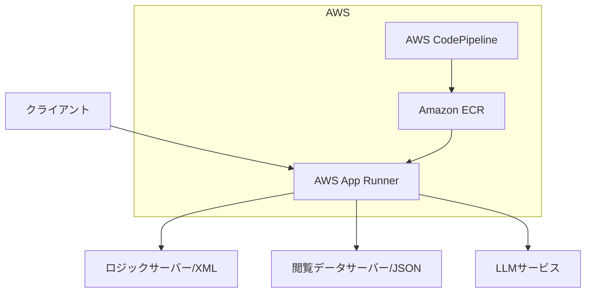

# アーキテクチャ設計

## 1. 処理フロー

1. **閲覧データサーバー**から JSON 形式のデータを受け取る
   ```json
   [
     {
       "category": "Books",
       "title": "The Great Gatsby"
     },
     {
       "category": "Movies",
       "title": "Inception"
     }
   ]
   ```

2. **ロジックサーバー**から XML 形式のデータを取得し解析する
   ```xml
   <?xml version="1.0" encoding="Windows-31J" ?>
   <uranai>
     <content>
       <title>26.守護霊ID[4]x運気ID[9]</title>
       <explanation id='ghost'>4</explanation>
       <explanation id='text1'>menu[1]-id[9]-text1</explanation>
     </content>
   </uranai>
   ```

3. **占い項目6個の回答を生成**
   ```json
   [
     {
       "ghost_id": 1,
       "fortune_items": "Love",
       "answer": "You will find unexpected moments of romance..."
     }
   ]
   ```

4. **回答の要約を生成**
   ```json
   [
     {
       "ghost_id": 1,
       "summary": "Love",
       "answer": "You will find unexpected moments of romance..."
     }
   ]
   ```

## 2. システム構成図



## 3. API エンドポイント

### `/healthcheck` (GET)
- ヘルスチェック用エンドポイント
- レスポンス: `{"status": "ok"}`

### `/generateFortune` (POST)
- 占い生成用メインエンドポイント
- レスポンス: 占い結果と要約のJSON

## 4. 外部依存

- **ロジックサーバー**: XML形式のデータを提供
- **閲覧データサーバー**: JSON形式のデータを提供
- **LLMサービス**: 回答生成と要約を担当 