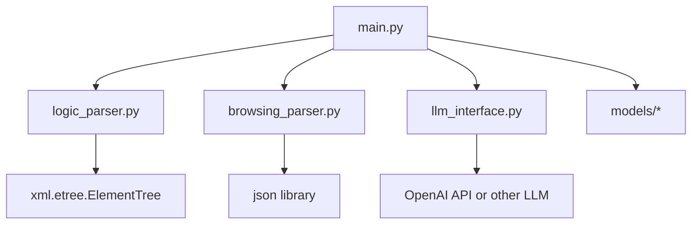

# ディレクトリ構成とファイルの役割

## 1. ディレクトリ構造

```plaintext
.
├── README.md
├── requirements.txt
├── src
│   ├── main.py                 # FastAPI メインエントリーポイント
│   ├── logic_parser.py         # ロジックサーバーから取得したXMLをパースするモジュール
│   ├── browsing_parser.py      # 閲覧データサーバーから取得したJSONをパース/処理するモジュール
│   ├── llm_interface.py        # LLM問い合わせ処理を行うモジュール
│   ├── models
│   │   ├── request_models.py   # FastAPI リクエスト用モデル
│   │   ├── response_models.py  # FastAPI レスポンス用モデル
│   └── utils
│       └── helpers.py          # 共通関数（ユーティリティ）
├── tests
│   ├── test_main.py
│   ├── test_logic_parser.py
│   ├── test_browsing_parser.py
│   ├── test_llm_interface.py
├── docker
│   └── Dockerfile
├── iac
│   └── codepipeline_app_runner.yaml
└── .gitignore
```

## 2. 主要ファイルの役割

### `src/main.py`
- FastAPIアプリケーションのエントリーポイント
- エンドポイントの定義
- 外部サーバーからのデータ取得とパース処理の呼び出し
- LLM問い合わせ処理の呼び出し

### `src/logic_parser.py`
- XMLデータのパース処理
- `ghost` IDの収集と整理
- 属性の抽出と整理

### `src/browsing_parser.py`
- JSONデータの整形・加工
- カテゴリーとタイトルの抽出

### `src/llm_interface.py`
- LLMへの問い合わせ処理
- 回答生成と要約生成の実装

### `src/models/`
- `request_models.py`: リクエストのバリデーション
- `response_models.py`: レスポンスの型定義

### `src/utils/helpers.py`
- 文字列正規化
- 日付計算
- ロギング用関数

## 3. 依存関係

