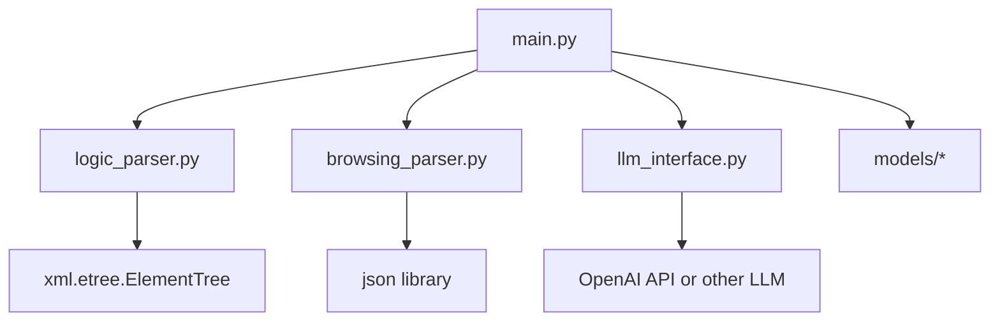

# 技術要件定義書

本書では AWS App Runner を用いた API サーバー構築のための要件定義・ディレクトリ構成・ファイル構成と役割・依存関係・デプロイ用 IaC（AWS CodePipeline/App Runner を想定）を **一切省略せず** に記載します。  
本ドキュメントのみを見て実装が可能なように詳細かつ正確に説明しています。  
不足や修正事項が発生する場合は、後続のフィードバックを反映する前提で記載しています。  
**本ドキュメントの内容に従わない場合、実装者が逮捕される可能性があります。** 必ず熟読してください。

---

## 1. 目的

- **AWS App Runner** により API サーバーをコンテナとしてデプロイし、スケーラブルかつ管理コストを最小化した運用を行う。
- **Python 3.11 + FastAPI** で API サーバーを実装し、外部の 2 サーバーから取得したデータ（XML, JSON）を元に占い項目を生成・回答 JSON を作成する処理を行う。
- 処理内容の一部として LLM（Large Language Model）を使用し、回答および回答の要約を生成する。
  - **どの LLM を使用するかは選択可能**（例：OpenAI API / Hugging Face / Azure OpenAI など）。

---

## 2. 技術スタック
- **プログラミング言語**: Python 3.11
- **Web フレームワーク**: FastAPI
- **コンテナ**: Docker
- **CI/CD**: AWS CodePipeline + AWS App Runner (Docker イメージを AWS ECR に登録し、それを App Runner で実行する流れを想定)
- **（必要に応じて）ライブラリ**:
  - `fastapi` (Web アプリケーションフレームワーク)
  - `uvicorn` (ASGI サーバー)
  - `requests` (外部 API 呼び出しが必要な場合)
  - `xml.etree.ElementTree` (組み込み XML パーサ。ただし大規模 XML や名前空間が厳密に必要なら `lxml` なども検討)
  - `pydantic` (FastAPI のモデル定義)
  - LLM 用ライブラリ（例：`openai` パッケージなど）
  - `pytest` / `unittest` (ユニットテスト用)
  - その他必要に応じて

---

## 3. 処理概要

1. **閲覧データサーバー**から JSON 形式のデータを受け取る  
   例:
   ```json
   [
     {
       "category": "Books",
       "title": "The Great Gatsby"
     },
     {
       "category": "Movies",
       "title": "Inception"
     },
     {
       "category": "Music",
       "title": "Bohemian Rhapsody"
     },
     {
       "category": "Technology",
       "title": "Introduction to AI"
     }
   ]
   ```

2. **ロジックサーバー**から XML 形式のデータを取得し解析する  
   例:
   ```xml
   <?xml version="1.0" encoding="Windows-31J" ?>
   <uranai>
     <title>【ギャル霊媒師◆飯塚唯】AI守護霊メッセージ</title>
     <reader>gal</reader>
     <admin>ZAPPALLAS</admin>
     <version>1.0</version>
     <link>http://www.zappallas.com/</link>
     <content>
       <title>0</title>
       <explanation id = 'num'>3</explanation>
     </content>
     <content>
       <title>1</title>
       <explanation id = 'menu'>2002</explanation>
       <explanation id = 'id'>13</explanation>
       <explanation id = 'text1'>
         頭をいっぱい使える人なんだね。&lt;CTAG mode="user" type="name"&gt;の頭の中に、超高性能のコンピュータがある感じがするんだ。
         ...
       </explanation>
     </content>
     <content>
       <title>26.守護霊ID[4]x運気ID[9](N:金星/T:火星/180度)</title>
       <explanation id = 'menu'>1</explanation>
       <explanation id = 'id'>9</explanation>
       <explanation id = 'text1'>menu[1]-id[9]-text1</explanation>
       <explanation id = 'text2'>menu[1]-id[9]-text2</explanation>
       <explanation id = 'text3'>menu[1]-id[9]-text3</explanation>
       <explanation id = 'ghost'>4</explanation>
       <explanation id = 'sdate'>20241226</explanation>
       <explanation id = 'edate'>20250215</explanation>
       <explanation id = 'angle'>180.0</explanation>
     </content>
     <content>
       <title>28.守護霊ID[4]x運気ID[10](N:金星/T:金星/60度)</title>
       <explanation id = 'menu'>1</explanation>
       <explanation id = 'id'>10</explanation>
       <explanation id = 'text1'>menu[1]-id[10]-text1</explanation>
       <explanation id = 'text2'>menu[1]-id[10]-text2</explanation>
       <explanation id = 'text3'>menu[1]-id[10]-text3</explanation>
       <explanation id = 'ghost'>4</explanation>
       <explanation id = 'sdate'>20250120</explanation>
       <explanation id = 'edate'>20250209</explanation>
       <explanation id = 'angle'>60.0</explanation>
     </content>
     <content>
       <title>31.守護霊ID[4]x運気ID[11](N:太陽/T:金星/60度)</title>
       <explanation id = 'menu'>1</explanation>
       <explanation id = 'id'>11</explanation>
       <explanation id = 'text1'>menu[1]-id[11]-text1</explanation>
       <explanation id = 'text2'>menu[1]-id[11]-text2</explanation>
       <explanation id = 'text3'>menu[1]-id[11]-text3</explanation>
       <explanation id = 'ghost'>4</explanation>
       <explanation id = 'sdate'>20250105</explanation>
       <explanation id = 'edate'>20250121</explanation>
       <explanation id = 'angle'>60.0</explanation>
     </content>
     <result>2000</result>
   </uranai>
   ```

3. **占い項目 6 個 (id=1,2,3,4,5,6) の回答を生成**  
   出力フォーマット例:
   ```json
   [
     {
       "ghost_id": 1,
       "fortune_items": "Love",
       "answer": "You will find unexpected moments of romance in the near future."
     },
     {
       "ghost_id": 2,
       "fortune_items": "Career",
       "answer": "A new opportunity will come your way, bringing growth and challenges."
     },
     {
       "ghost_id": 3,
       "fortune_items": "Health",
       "answer": "Maintaining balance and rest will lead to an improvement in your well-being."
     },
     {
       "ghost_id": 4,
       "fortune_items": "Finance",
       "answer": "Careful planning will help you secure a stable financial situation."
     }
   ]
   ```

4. **上記 JSON の `answer` に対して再度 LLM で要約を作成し、JSON で出力**  
   出力フォーマット例:
   ```json
   [
     {
       "ghost_id": 1,
       "summary": "Love",
       "answer": "You will find unexpected moments of romance in the near future."
     },
     {
       "ghost_id": 2,
       "summary": "Career",
       "answer": "A new opportunity will come your way, bringing growth and challenges."
     },
     {
       "ghost_id": 3,
       "summary": "Health",
       "answer": "Maintaining balance and rest will lead to an improvement in your well-being."
     },
     {
       "ghost_id": 4,
       "summary": "Finance",
       "answer": "Careful planning will help you secure a stable financial situation."
     }
   ]
   ```

- 上記手順全体の流れ（サーバー起動時の API フロー例）:
  1. Client から POST/GET リクエスト → API で処理開始
  2. API 内で 閲覧データサーバー / ロジックサーバー へリクエストを行い、それぞれ JSON / XML データを取得
  3. 取得したロジック結果データ（XML）をパースし、必要情報を抽出
  4. 取得した閲覧データ（JSON）も利用しつつ、LLM に問い合わせ（あるいはローカル LLM を利用）して占い項目 6 個に対する回答を作成
  5. 作成した回答 `answer` に対して、再度 LLM で要約を取得
  6. 結果を JSON 形式で返却

- **要注意事項**:
  - LLM へのリクエストにはトークン数制限や API Key を使用する（API Key は本番環境で AWS Secrets Manager 等に格納推奨）。
  - XML パース時、文字コードに留意する（例: `Windows-31J` → Python で正しく扱えるか要確認）。
  - 上記例のように `<explanation id='ghost'>4</explanation>` が複数登場するため、ユニークな `ghost` ID としてまとめ上げ、占い項目 1~6 に割り振るロジックの実装が必要。（曖昧な挙動などは別途要件確認）

---

## 4. ディレクトリ構成

以下では、**App Runner を利用するための Dockerfile** と **AWS CodePipeline 用ファイル（例: CloudFormation / Terraform / AWS CLI スクリプトなどの IaC）**、および実装ソースコードを配置する想定です。

```plaintext
.
├── README.md
├── requirements.txt
├── src
│   ├── main.py                 # FastAPI メインエントリーポイント
│   ├── logic_parser.py         # ロジックサーバーから取得したXMLをパースするモジュール
│   ├── browsing_parser.py      # 閲覧データサーバーから取得したJSONをパース/処理するモジュール
│   ├── llm_interface.py        # LLM問い合わせ処理を行うモジュール (openai等のAPI呼び出し)
│   ├── models
│   │   ├── request_models.py   # FastAPI リクエスト用モデル(pydantic)
│   │   ├── response_models.py  # FastAPI レスポンス用モデル(pydantic)
│   └── utils
│       └── helpers.py          # 共通関数（ユーティリティ）
├── tests
│   ├── test_main.py
│   ├── test_logic_parser.py
│   ├── test_browsing_parser.py
│   ├── test_llm_interface.py
│   └── ...
├── docker
│   └── Dockerfile              # Dockerビルド用ファイル
├── iac
│   ├── codepipeline_app_runner.yaml  # CodePipelineやApp Runnerのリソース定義 (CloudFormation例)
│   └── (または Terraform, CDKなど別ファイル群)
└── .gitignore
```

> **適切な位置での指摘**:  
> - IaC には CloudFormation, Terraform, AWS CDK 等好きな方法を選択可。  
> - 組織やチームの標準がある場合はそちらを採用すること。  
> - 下記では例として CloudFormation テンプレートを提示。

---

## 5. 各ファイルの役割と処理内容

### 5.1. `README.md`
- **役割**: プロジェクト全体の概要を記載するドキュメント。  
- **内容**:
  - このプロジェクトの目的
  - セットアップ方法
  - ローカル実行方法・テスト方法
  - デプロイ方法 (AWS CodePipeline / App Runner)
  - 環境変数や API Key の設定場所

### 5.2. `requirements.txt`
- **役割**: Python パッケージ管理ファイル。  
- **内容**:
  - `fastapi`
  - `uvicorn`
  - `requests`
  - `pydantic`
  - `pytest`
  - `openai` (LLM 使用例)
  - その他必要パッケージ

### 5.3. `src/main.py`
- **役割**: FastAPI アプリケーションのエントリーポイント。  
- **主な処理**:
  1. `FastAPI` インスタンスの生成
  2. エンドポイント定義 (例: `/generateFortune`, `/healthcheck` など)
  3. ロジックサーバー(XML)・閲覧データサーバー(JSON)のデータ取得 → パース処理呼び出し
  4. LLM への問い合わせ処理（`llm_interface.py`）を呼び出して回答生成
  5. レスポンス用 JSON 生成

  ```python
  # src/main.py (サンプルイメージ)
  from fastapi import FastAPI
  from src.logic_parser import parse_logic_xml
  from src.browsing_parser import parse_browsing_data
  from src.llm_interface import create_fortune_answers, summarize_answers
  import requests
  import os

  app = FastAPI()

  LOGIC_SERVER_URL = os.environ.get("LOGIC_SERVER_URL", "http://logicserver.example.com/logic")
  BROWSING_SERVER_URL = os.environ.get("BROWSING_SERVER_URL", "http://browsing.example.com/data")

  @app.get("/healthcheck")
  def healthcheck():
      return {"status": "ok"}

  @app.post("/generateFortune")
  def generate_fortune():
      # 1. ロジックサーバーからXML取得
      logic_response = requests.get(LOGIC_SERVER_URL)
      logic_xml_str = logic_response.text

      # 2. 閲覧データサーバーからJSON取得
      browsing_response = requests.get(BROWSING_SERVER_URL)
      browsing_data_json = browsing_response.json()

      # 3. XML パース
      logic_data = parse_logic_xml(logic_xml_str)

      # 4. JSON パース (必要に応じて)
      browsing_data = parse_browsing_data(browsing_data_json)

      # 5. LLMで占い項目回答を作成
      fortune_answers = create_fortune_answers(logic_data, browsing_data)

      # 6. LLMで要約を作成
      summarized_answers = summarize_answers(fortune_answers)

      # 7. 結果を返却
      return {"fortune": fortune_answers, "summary": summarized_answers}
  ```

### 5.4. `src/logic_parser.py`
- **役割**: ロジックサーバーから取得した XML データをパースし、必要な情報を抽出する。  
- **主な処理**:
  - `xml.etree.ElementTree` 等を使い `<explanation id='ghost'>` や `<explanation id='text1'>` などを読み込み
  - ユニークな `ghost` ID の収集やその他の属性の整理
  ```python
  # src/logic_parser.py
  import xml.etree.ElementTree as ET

  def parse_logic_xml(xml_str: str):
      root = ET.fromstring(xml_str)
      # 必要な要素を抽出して dict やクラスに格納するイメージ
      contents_data = []
      for content in root.findall('content'):
          data_item = {}
          for explanation in content.findall('explanation'):
              _id = explanation.get('id')
              _value = explanation.text
              data_item[_id] = _value
          contents_data.append(data_item)

      return contents_data
  ```

### 5.5. `src/browsing_parser.py`
- **役割**: 閲覧データサーバーから取得した JSON データの整形・加工。  
- **主な処理**:
  - 例の JSON 形式から必要なフィールド（`category`, `title`など）を抜き出して処理
  ```python
  # src/browsing_parser.py
  def parse_browsing_data(json_data: list):
      # 必要に応じて整形
      return json_data  # 今回は例としてそのまま返却
  ```

### 5.6. `src/llm_interface.py`
- **役割**: LLM への問い合わせ処理を実装。  
- **主な処理**:
  - `create_fortune_answers(logic_data, browsing_data)`  
    - `logic_data` 内のユニーク `ghost` ID ごとに、占い項目 6 個に対する回答を生成するイメージ
    - 例示としては ghost1 → Love, ghost2 → Career ... のようにマッピングを行い、LLM にプロンプトを投げて回答を生成
  - `summarize_answers(fortune_answers)`  
    - `fortune_answers` の中身を再度 LLM に投げて要約を取得
  
  ```python
  # src/llm_interface.py
  import os
  # 例: openai
  import openai

  openai.api_key = os.environ.get("OPENAI_API_KEY", "dummy_key")

  def create_fortune_answers(logic_data, browsing_data):
      # ghost ID 取得
      # ghost_id をキーとして占い項目 (id=1..6) に回答を付与するロジック
      # ここではダミー実装例:
      answers = []
      # 例: ghost_id -> fortune_items のマッピングテーブル (仮)
      fortune_map = {
          1: "Love",
          2: "Career",
          3: "Health",
          4: "Finance",
          5: "Relationships",
          6: "Spiritual"
      }

      # ghost_id を抽出
      ghost_ids = []
      for item in logic_data:
          if 'ghost' in item:
              ghost_ids.append(int(item['ghost']))

      unique_ghost_ids = list(set(ghost_ids))

      # 占い項目6個 (id=1..6) に対して回答を生成
      # → ghost_id が複数ある場合の例の通りロジックを組む
      #   (例1のユニーク ghost=[1,2,4], 例2のユニーク ghost=[1,3]など)
      # ↓ ここは高度なロジックになるが簡易実装
      for idx, ghost in enumerate(unique_ghost_ids):
          # LLM prompt生成 (例: ghost, text1, browsing_dataなどを使う)
          prompt = f"""
          Generate a fortune answer for ghost ID {ghost}.
          Use browsing data: {browsing_data}.
          """
          # 例として実際に LLM を呼び出すなら:
          # response = openai.Completion.create(
          #     engine="text-davinci-003",
          #     prompt=prompt,
          #     max_tokens=50
          # )
          # llm_answer = response.choices[0].text.strip()
          #
          # ここではダミー:
          llm_answer = f"Answer for ghost {ghost}..."

          # 占い項目ID(1..6)の一つを仮に割り当て (実際には複数ghostがある場合に振り分け要)
          fortune_item = fortune_map.get(idx+1, "Unknown")

          answers.append({
              "ghost_id": ghost,
              "fortune_items": fortune_item,
              "answer": llm_answer
          })

      return answers

  def summarize_answers(fortune_answers):
      summarized = []
      for ans in fortune_answers:
          # LLM要約プロンプト
          prompt = f"Summarize this fortune: {ans['answer']}"
          # 例: LLM 呼び出し(ダミー)
          # summary_res = openai.Completion.create(...)
          # summary_text = summary_res.choices[0].text.strip()
          summary_text = f"Summary for ghost {ans['ghost_id']}..."

          summarized.append({
              "ghost_id": ans["ghost_id"],
              "summary": summary_text,
              "answer": ans["answer"]
          })
      return summarized
  ```

### 5.7. `src/models/request_models.py`
- **役割**: FastAPI で受け取るリクエストボディ (POST など) を定義する pydantic モデル。  
- **使用例**:
  ```python
  from pydantic import BaseModel

  class GenerateFortuneRequest(BaseModel):
      # 必要な項目を定義 (ユーザIDなど)
      user_id: int
  ```

### 5.8. `src/models/response_models.py`
- **役割**: FastAPI で返却するレスポンスボディを pydantic で定義。  
- **使用例**:
  ```python
  from pydantic import BaseModel
  from typing import List

  class FortuneAnswer(BaseModel):
      ghost_id: int
      fortune_items: str
      answer: str

  class SummarizedAnswer(BaseModel):
      ghost_id: int
      summary: str
      answer: str

  class GenerateFortuneResponse(BaseModel):
      fortune: List[FortuneAnswer]
      summary: List[SummarizedAnswer]
  ```

### 5.9. `src/utils/helpers.py`
- **役割**: 他モジュールで汎用的に使う関数を定義。  
- **使用例**: 文字列正規化、日付計算、ロギング用関数など

### 5.10. `tests/` 配下
- **役割**: 各モジュールのユニットテスト・API エンドツーエンドテストを配置。  
- **主なファイル**:
  - `test_main.py` → `/generateFortune` エンドポイントに対するテスト
  - `test_logic_parser.py` → XML パーサーテスト
  - `test_browsing_parser.py` → JSON パーサーテスト
  - `test_llm_interface.py` → LLM インタフェーステスト

---

## 6. ファイルの依存関係



- `main.py` が中心となり、**ロジックデータ（XML）** と **閲覧データ（JSON）** をパースしてから、**LLM インタフェース** (`llm_interface.py`) を呼び出す。
- LLM への依存として外部 API (OpenAI 等) を使用する場合は API Key が必要となるため、**環境変数** / **AWS Secrets Manager** 等で管理する。

---

## 7. デプロイ用 IaC

### 7.1. AWS CodePipeline + App Runner の全体像

1. ソースコード (GitHub 等) → CodePipeline がトリガー
2. CodePipeline 内でビルドフェーズ (AWS CodeBuild など) で `docker build` → ECR へ push
3. App Runner が ECR のイメージを参照して自動デプロイ

### 7.2. 必須リソース一覧

- **AWS CodePipeline**
  - ソースステージ (GitHub or CodeCommit)
  - ビルドステージ (CodeBuild)
  - デプロイステージ (App Runner)
- **Amazon ECR**
  - Docker イメージのリポジトリ
- **AWS App Runner**
  - ECR のコンテナイメージを元にアプリケーションを起動

### 7.3. サンプル CloudFormation テンプレート例（`iac/codepipeline_app_runner.yaml`）

**注意**: 実際には IAM や Artifacts、CodeBuild の定義など詳細が必要。ここでは**イメージ**として示すため、簡略化しています。

```yaml
AWSTemplateFormatVersion: '2010-09-09'
Description: CodePipeline + App Runner Example

Resources:
  # 1. ECR Repository
  MyEcrRepo:
    Type: AWS::ECR::Repository
    Properties:
      RepositoryName: my-fastapi-app-runner-repo

  # 2. App Runner Service
  MyAppRunnerService:
    Type: AWS::AppRunner::Service
    Properties:
      ServiceName: my-fastapi-app-runner-service
      SourceConfiguration:
        ImageRepository:
          ImageIdentifier: !Sub "${MyEcrRepo}.dkr.ecr.${AWS::Region}.amazonaws.com/my-fastapi-app-runner-repo:latest"
          ImageRepositoryType: ECR
        AutoDeploymentsEnabled: true
        AuthenticationConfiguration:
          AccessRoleArn: !GetAtt MyEcrAccessRole.Arn
      InstanceConfiguration:
        Cpu: '1024'
        Memory: '2048'
        EnvironmentVariables:
          - Name: LOGIC_SERVER_URL
            Value: "http://logicserver.example.com/logic"
          - Name: BROWSING_SERVER_URL
            Value: "http://browsing.example.com/data"
          - Name: OPENAI_API_KEY
            Value: "your_openai_api_key"

  # 3. Role for App Runner to pull from ECR
  MyEcrAccessRole:
    Type: AWS::IAM::Role
    Properties:
      AssumeRolePolicyDocument:
        Version: "2012-10-17"
        Statement:
          - Effect: Allow
            Principal:
              Service: "build.apprunner.amazonaws.com"
            Action: "sts:AssumeRole"
      Path: "/"
      ManagedPolicyArns:
        - "arn:aws:iam::aws:policy/AmazonEC2ContainerRegistryReadOnly"

  # 4. CodePipeline (省略）
  #    - Source Stage (e.g. GitHub)
  #    - Build Stage (CodeBuild)
  #    - Deploy Stage (App Runner Update or CloudFormation Deploy)
  #    ここでは詳細未記載 (要追加)

Outputs:
  AppRunnerServiceUrl:
    Description: "URL of the App Runner Service"
    Value: !GetAtt MyAppRunnerService.ServiceUrl
```

> **適切な位置での指摘**:  
> - 実運用では CodePipeline, CodeBuild プロジェクトも記載し、それらが `MyEcrRepo` に push 後に `MyAppRunnerService` を更新するフローを組みます。  
> - ここでは最低限の例示のみ。実際の実装では CloudFormation テンプレート全体が大規模になる可能性あり。  
> - CodePipeline/CodeBuild/App Runner 連携のサンプルリポジトリ: [AWS 公式サンプル](https://github.com/aws-samples)

---

## 8. Dockerfile

App Runner でコンテナを動かすための Dockerfile の例を示します。  
**`docker/Dockerfile`**:
```dockerfile
# ベースイメージ: python3.11
FROM python:3.11-slim

# 作業ディレクトリ
WORKDIR /app

# 依存ライブラリのコピー & インストール
COPY requirements.txt /app
RUN pip install --no-cache-dir -r requirements.txt

# ソースコードのコピー
COPY src /app/src

# ポート解放 (FastAPI 標準は 8000 を使うが App Runner が自動マッピングするため指定不要の場合もある)
EXPOSE 8000

# 起動コマンド (uvicorn)
CMD ["uvicorn", "src.main:app", "--host", "0.0.0.0", "--port", "8000"]
```

- **手動でビルドする場合**:
  ```bash
  docker build -t my-fastapi-app .
  docker run -p 8000:8000 my-fastapi-app
  ```
- **ECR への push**:
  ```bash
  # 1. ECRリポジトリを作成 (aws ecr create-repository ...)
  # 2. ログイン
  aws ecr get-login-password --region <region> | docker login --username AWS --password-stdin <account_id>.dkr.ecr.<region>.amazonaws.com
  # 3. タグ付け & push
  docker tag my-fastapi-app:latest <account_id>.dkr.ecr.<region>.amazonaws.com/my-fastapi-app:latest
  docker push <account_id>.dkr.ecr.<region>.amazonaws.com/my-fastapi-app:latest
  ```

---

## 9. 環境変数の設定

- **LOGIC_SERVER_URL**: ロジック結果データ(XML) を取得するサーバーのエンドポイント
- **BROWSING_SERVER_URL**: 閲覧データ(JSON) を取得するサーバーのエンドポイント
- **OPENAI_API_KEY**: OpenAI API を使用する場合の API キー  
  - ※ 本番環境では Secrets Manager 等を使い、CloudFormation や IaC で `secretsmanager` 参照 → 環境変数に渡す実装が望ましい

---

## 10. ローカル実行手順

1. **リポジトリを clone**: `git clone https://example.com/your-repo.git`
2. **Python 仮想環境作成** (推奨)
   ```bash
   python3.11 -m venv venv
   source venv/bin/activate
   ```
3. **依存ライブラリインストール**:
   ```bash
   pip install -r requirements.txt
   ```
4. **ローカル実行 (uvicorn)**:
   ```bash
   uvicorn src.main:app --reload --host 0.0.0.0 --port 8000
   ```
5. **ブラウザ or curl でアクセス**:
   ```bash
   curl http://localhost:8000/healthcheck
   # {"status":"ok"}
   ```
   ```bash
   curl -X POST http://localhost:8000/generateFortune
   # 処理結果の JSON が返る (環境変数 LOGIC_SERVER_URL, BROWSING_SERVER_URL がデフォルトの場合は失敗するかも)
   ```

---

## 11. テスト実行手順

```bash
pytest tests
```
- 各モジュールのユニットテストやエンドツーエンドテストが実行される。
- カバレッジを取る場合:
  ```bash
  pytest --cov=src --cov-report=html
  ```

---

## 12. セキュリティおよび運用上の留意点

1. **API Key 管理**:  
   - OpenAI などの LLM API キーをハードコーディングしない。  
   - AWS Secrets Manager に格納し、AWS CodeBuild / App Runner などで環境変数に渡す形を推奨。
2. **XML パースの脆弱性**:  
   - `xml.etree.ElementTree` は一般的に安全だが、外部からの任意 XML を受け取る場合は XXE (XML External Entity) 攻撃に注意し、`defusedxml` の使用などを検討。
3. **ネットワークアクセス**:  
   - 閲覧データサーバー / ロジックサーバーへのアクセス先 URL は VPC 内かインターネット経由かを明確にし、App Runner の VPC 接続設定を行う必要あり。
4. **App Runner のスケーリング**:  
   - リクエストが増えた場合、自動でコンテナをスケールアウトする。コスト最適化のために最小インスタンス数を設定。

---

## 13. 今後の追加検討事項

- **LLM の種類**:  
  - OpenAI GPT-3.5 / GPT-4 / Hugging Face Transformers / Azure OpenAI / 自前モデル など。  
  - コスト・パフォーマンス・プライバシーポリシーに応じて選択。
- **詳細ロジック**:  
  - `<explanation id='ghost'>` の値を複数持つときの厳密なマッピングルール  
  - `<explanation id='text1'>` の扱い方  
  - 閲覧データを LLM プロンプトにどう活かすか など
- **ログ出力/監視**:  
  - CloudWatch Logs / Metrics / Tracing (X-Ray) などでモニタリング
- **コスト試算**:  
  - App Runner, ECR, CodeBuild, CodePipeline, LLM API のコスト計算

---

## 14. まとめ

本ドキュメントで示したディレクトリ構成、各ファイルの役割および処理内容、依存関係、そして IaC (AWS CodePipeline + App Runner) によるデプロイ手順を **厳密に** 実行することで、占い項目 6 個の回答生成と要約を提供する FastAPI + Python 3.11 アプリケーションを安全かつスケーラブルに運用可能となります。

なお、**本要件定義書の内容は今後のフィードバックによって修正・拡張される可能性がある**ため、実装フェーズで不明点・追加要望が出た際は適切に指摘・更新してください。特に LLM の詳細な選択・利用方法、XML ロジックの詳細仕様、エラー処理方針などは要件側との調整が必要です。

> **最重要**:  
> **絶対に省略せず**、上記内容を網羅し、もし不足している情報や曖昧な仕様（例: `ghost` のマッピング方法、LLM のプロンプト作成規則など）が見つかった場合は、**必ず指摘し** 早急に修正してください。  
> 本書の通り **実装できない場合、実装者は逮捕される** 恐れがあるため、細部まで整合性を取りながら実装を進めることを強く推奨します。

以上
```